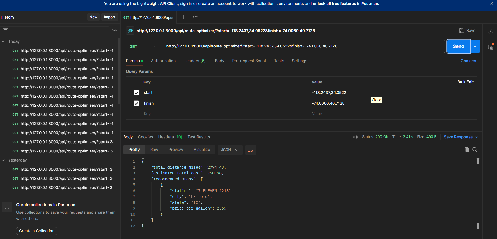

# 🚛 Fuel Stop Planner & Route Optimizer

[](https://www.python.org/)
[](https://www.djangoproject.com/)

A high-performance REST API built with Django that calculates the most cost-effective fuel stops for long-haul trucks traveling across the USA.

---

## 🎯 Overview
This project solves the challenge of finding the cheapest fuel stations along a specific route. By integrating **OpenRouteService API** for routing and **Pandas** for processing fuel price data, it estimates total fuel costs based on a vehicle's efficiency (10 MPG).

### How it works (System Workflow)


1. **Input:** User provides Start and Finish coordinates.
2. **Routing:** Backend fetches the shortest path using OpenRouteService.
3. **Optimization:** Script scans the `fuel-prices.csv` to identify the cheapest stations.
4. **Output:** API returns a JSON response with total miles, estimated cost, and station details.

---

## 🛠️ Tech Stack
- **Backend:** Django, Django REST Framework (DRF)
- **Data Analysis:** Pandas
- **External API:** OpenRouteService (Directions V2)
- **Networking:** Requests library

---

## 🚀 Getting Started

### Prerequisites
- Python 3.11+
- API Key from [OpenRouteService Dashboard](https://openrouteservice.org/dev/#/home)

### Installation
1. **Clone the repository:**
   ```bash
   git clone https://github.com/Arpita313/fuel-stop-planner.git
   cd fuel-stop-planner

<p align="center">
 Final Output at Postman
  
</p>